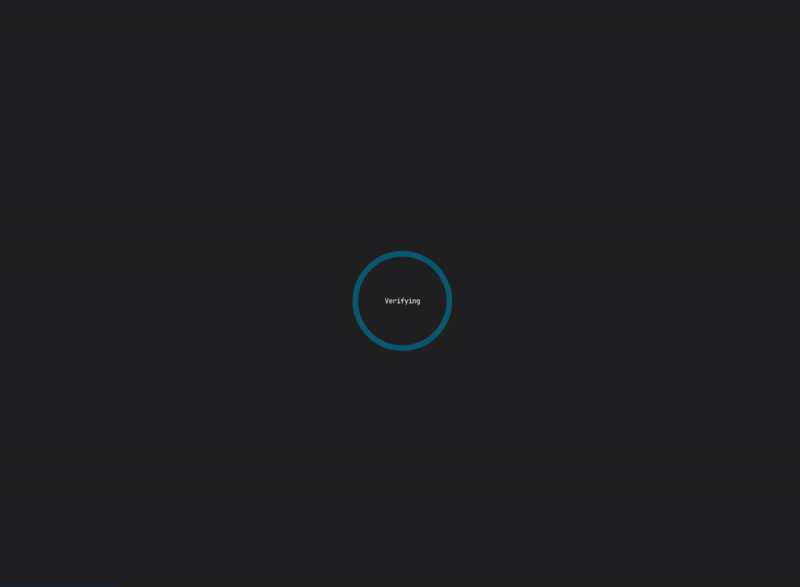

# DWL Fedora Environment

Complete desktop environment setup with Wayland, DWL window manager, and QOL tooling for Fedora Linux.




### Quick Install (Recommended)
Run this command to automatically download and install the dotfiles:

```bash
curl -sSL https://raw.githubusercontent.com/lghjufbjd/dotfiles/refs/heads/main/setup.sh | bash
```

### Manual Install
1. Clone this repository:
   ```bash
   git clone https://github.com/lghjufbjd/dotfiles.git
   cd dotfiles
   ```

2. Make the script executable and run it:
   ```bash
   chmod +x setup.sh
   ./setup.sh
   ```

### Optional Configuration
Before running the setup script, you can configure additional options by editing the script:

**Windows VM:**
To enable Windows VM creation, set the Windows ISO URL in the script:
```bash
WINDOWS_ISO_URL="https://example.com/Win11.iso"
```

This enables automatic Windows 11 VM creation alongside the Fedora VMs.

## Requirements
- Fedora Sway Spin
- Hardware virtualization support (KVM) for VM features

## Keybindings

### Applications
- `Mod4 + Return` - Open terminal (foot)
- `Alt + p` - Application launcher (mybemenu)
- `Mod4 + b` - Browser alternative launcher
- `Mod4 + Backspace` - Power menu

### Window Management
- `Mod4 + q` - Close window
- `Mod4 + j/k` - Focus next/previous window
- `Mod4 + h/l` - Resize window (decrease/increase)
- `Mod4 + Tab` - Switch to last used window
- `Mod4 + f` - Toggle floating
- `Mod4 + e` - Toggle fullscreen
- `Mod4 + Comma/Period` - Focus monitor left/right
- `Mod4 + Shift + </>` - Move window to monitor left/right
- `Mod4 + 1-9` - Switch to workspace
- `Mod4 + Shift + 1-9` - Move window to workspace
- `Mod4 + 0` - View all workspaces

### Custom Tools
- `Mod4 + v` - Clipboard manager
- `Mod4 + Shift + P` - Password manager
- `Mod4 + s` - System information
- `Mod4 + w` - Network manager
- `Print` - Screenshot tools
- `Mod4 + o` - Monitor manager
- 
### Media Controls
- `XF86AudioPlay/Pause` - Play/pause media
- `XF86AudioNext/Prev` - Next/previous track
- `XF86AudioRaiseVolume/LowerVolume` - Volume control
- `XF86AudioMute` - Mute/unmute
- `XF86MonBrightnessUp/Down` - Brightness control


## License

This project is open source and available under the MIT License.